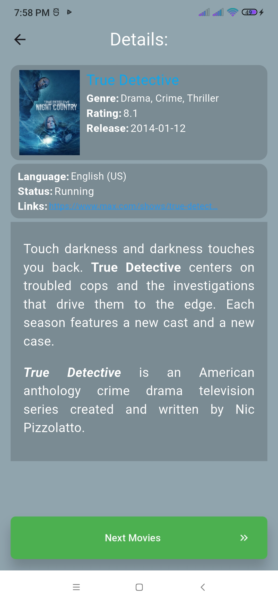

# Movie List

Movie listing flutter project for practice and demonstration purposes.  
This project was created to learn and practice basic app development concepts like API integration, UI design, and working with lists.

## What it does

- 📋 Fetches a list of shows from the [TVmaze API](https://www.tvmaze.com/api)
- 📂 Displays basic show details: title, summary, image
- 🔍 Simple UI to scroll through shows
- ✅ Good example of API calls, JSON parsing, and displaying dynamic data

## Screenshots

|  |  |